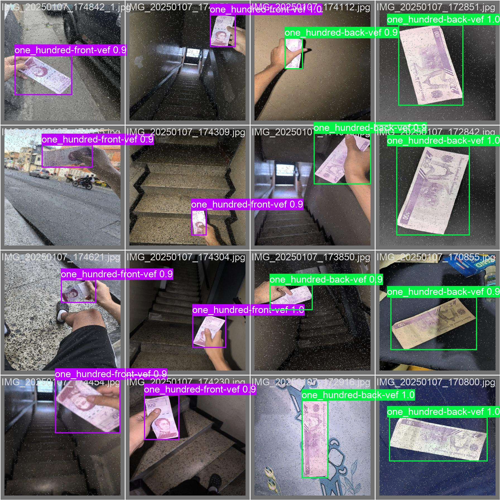
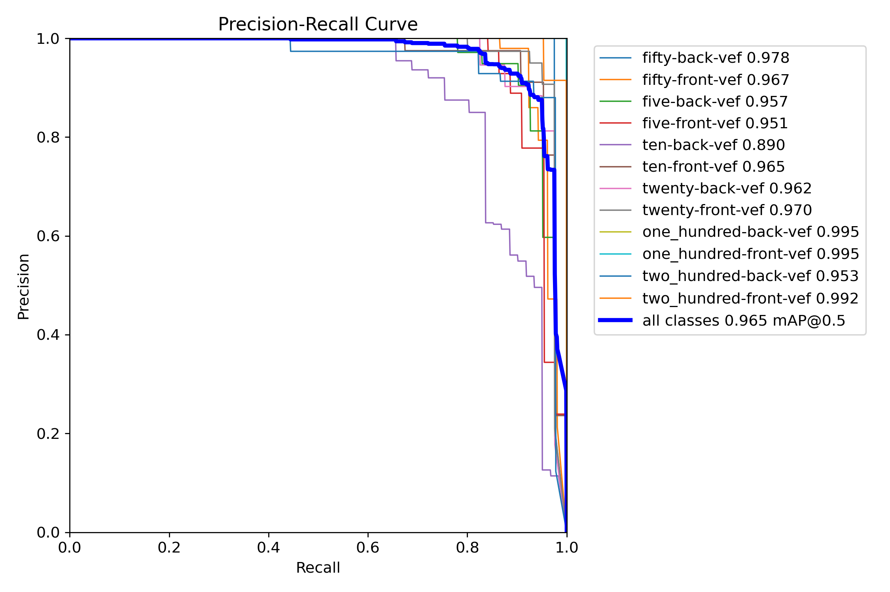
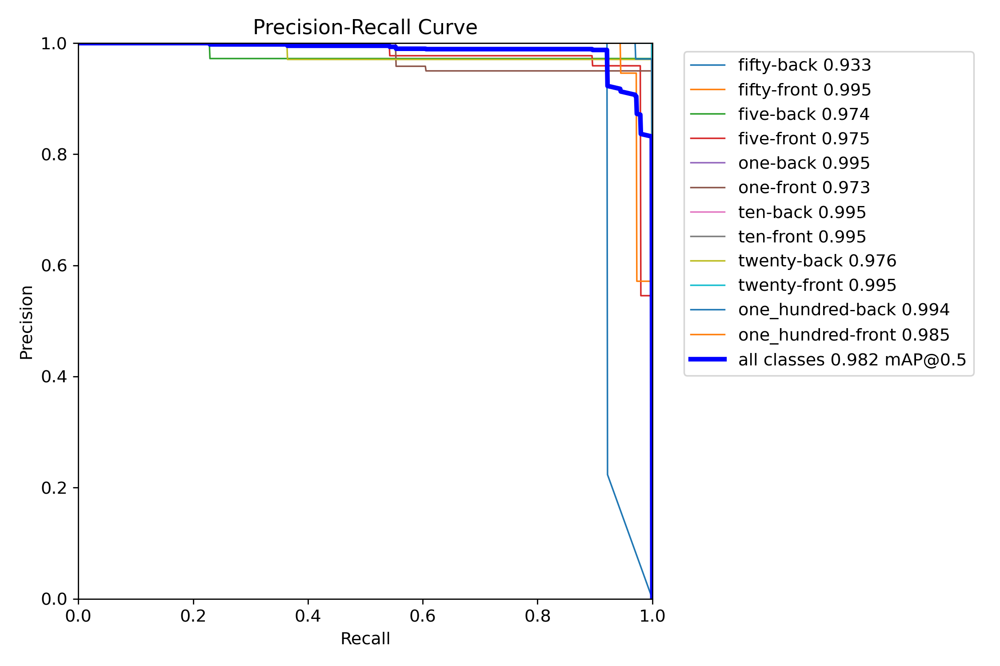

 

<h3 align="center"><strong>Cash Reader</strong></h3>

¡Transforma la manera en que interactúas con el dinero!
 
 
<a href="https://cashreader.netlify.app/"><strong>Visita nuestra página web »</strong></a>
 
 
<a href="https://github.com/repositoriosHackaton/SIC25-CodeBreakers/issues/new?labels=bug&amp;template=bug_report.md">Reportar Bug |</a>
<a href="https://github.com/repositoriosHackaton/SIC25-CodeBreakers/issues/new?labels=enhancement&amp;&template=feature_request.md"> Solicitar funcionalidad |</a>

**Cash Reader** es un proyecto realizado para el módulo de **Inteligencia Artificial** del curso *Samsung Innovation Campus*, y a su vez como proyecto final para la materia Programación III de la *Universidad Marítima del Caribe*.

## Índice de Contenidos
- [Índice de Contenidos](#índice-de-contenidos)
- [💡 ¿Qué es Cash Reader?](#-qué-es-cash-reader)
- [⚙️ Características clave](#️-características-clave)
- [🔧 Tecnologías](#-tecnologías)
- [📸 Imágenes](#-imágenes)
  - [Interfaz Web](#interfaz-web)
  - [Modelo de Clasificación de Bolívares](#modelo-de-clasificación-de-bolívares)
  - [Modelo de Clasificación de Dólares](#modelo-de-clasificación-de-dólares)
- [📜 Licencia](#-licencia)
- [👥 Integrantes del proyecto](#-integrantes-del-proyecto)
- [🎁 Donaciones](#-donaciones)

## 💡 ¿Qué es Cash Reader?
Se trata de un programa que integra:
- Dos modelos avanzados de **clasificación de objetos** para identificar las denominaciones de los billetes de **dólares y bolívares** y uno modelo diferenciador entre ambos tipos de moneda.
- **Landing page** donde los usuarios pueden descargar la app (PWA) y conocer informacion general del proyecto.
- **App PWA** desarrollada bajo el cumplimiento del manual de los estandares de accesibilidad (**WCAG 2.0**) integrando un narrador, una interfaz de comandos de voz, una funcion de utilidad para contar de forma asistida y los modelos de IA para la clasificacion de billetes.

## ⚙️ Características clave
- Detección y clasificación de billetes (unico modelo compatible en el mercado con el cono monetario actual de Venezuela) 💵
- Interfaz a traves de una progressive web app (PWA) 🌐:
  -    
- 3 Modelos basados en **YOLOv8s** ajustados con fine-tuning para mayor precisión 🎯:
  - Clasificador de Denominacion de billetes de Dolares Americanos
  - Clasificador de Denominacion de billetes de Bolivares Venezolanos
  - Diferenciador entre ambos tipos de divisas

## 🔧 Tecnologías
- **React:**: Para una experiencia web fluida y arquitectura orientada a componentes.
- **FastAPI:** Para la creación de una API robusta.
- **YOLO Ultralitics:** Arquitectura de un Modelo CNN para la detección y clasificación.
- **

## 📸 Imágenes
### Interfaz Web

### Modelo de Clasificación de Bolívares

### Modelo de Clasificación de Dólares

## 📜 Licencia
Distribuido bajo la licencia MIT. Consulte [LICENCIA](./LICENSE.txt) para más información.

## 👥 Integrantes del proyecto
- [Francisco Ramos](https://www.linkedin.com/in/francisco-ramos-santos-dev)
- [Joshua Carrera](https://www.linkedin.com/in/joshua-carrera-r/) 
- [Joel Escobar](https://www.linkedin.com/in/joel-escobar/) 
- [Jesús Cabello](https://www.linkedin.com/in/jesus-cabello18/) 
- [Jesús Ramírez](https://www.linkedin.com/in/jesus-ramirez-dev/) 

## 🎁 Donaciones
Si deseas apoyar el proyecto, puedes enviar **USDT** a través de la red **Binance (BSC)**:
**Dirección:** 0xe826bd3f1b387eef0974d57c6b04d047cc443e75  
¡Tu contribución ayuda a impulsar la innovación!
